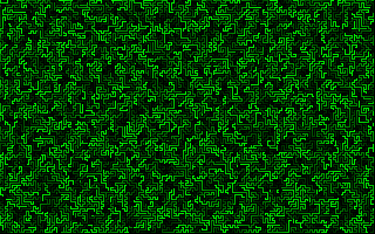

# maze.asm

`maze.asm` is a bootloader for x86 processor architecture written in assembly language that draws and animates a maze using mode 13h VGA graphics.

## How to run

To test the bootloader using qemu:

```bash
make
qemu-system-x86_64 -drive format=raw,file=maze.com
```

To boot inside the VirtualBox, build a virtual drive using `make vdi`, then open VirtualBox, create a new virtual machine and select maze.vdi as a boot media.

## Screenshot




## License

The code is licensed under MIT, although I doubt it will be useful for anyone.
